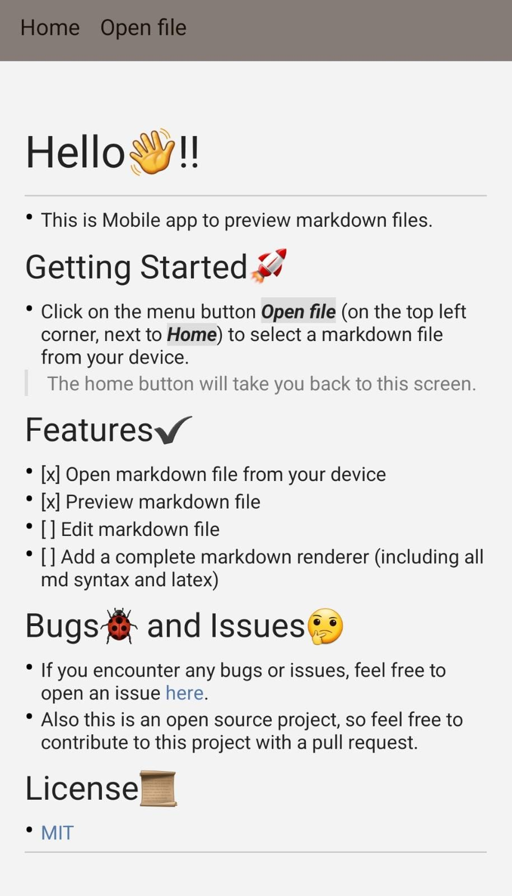

# Markdown mobile

## What is it?

- Markdown mobile is a mobile app for Android and iOS that allows you to preview Markdown files.

## Download

##### **For now, the download it's only aviable on `.apk`**

- There's two options to download the app:
  - [Download the `.apk`](https://github.com/Sergimayol/markdown-mobile/releases)
  - Or you can download the source code and run it on the Expo Go app.

### Options

#### Dowload the `.apk`

1. Install the `.apk` on your device
2. Run the app
3. Ready!

#### How to run the source code

1. Download the Expo App on your phone.
2. Run `npm install` on the project folder.
3. Run `npm start` or `expo start` on the project folder. (You need to have Expo installed on your divice).
4. Scan the QR code with the Expo Go App or introduce the link provided.
5. Ready!

## Development

```bash
$ npm install
$ expo start or npm start
```

## Project structure

```bash
.
├── App.tsx         # Entry point
└── src/
    ├── screens/    # Screen components
    ├── components/ # UI components
    ├── utils/      # Custom hooks and helpers
    ├── assets/     # Image files
    └── theme.ts    # Themes
```

## App preview

<p align="center"></p>

## License

[MIT](./LICENSE)
